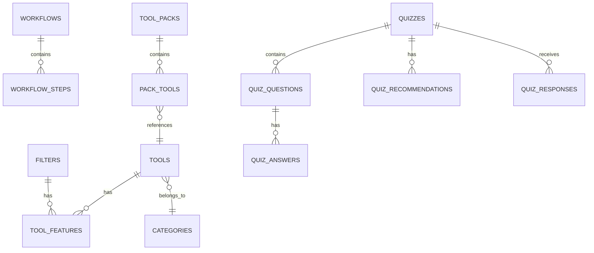

## Vue d'ensemble

Kit'Asso utilise **PostgreSQL via Supabase** avec 13 tables organisées en 4 groupes fonctionnels :

<CardGroup cols={2}>
  <Card title="Core" icon="database">
    Tools, Categories, Filters
  </Card>
  <Card title="Workflows" icon="route">
    Workflows, Workflow Steps
  </Card>
  <Card title="Packs" icon="box">
    Tool Packs, Pack Tools
  </Card>
  <Card title="Quiz" icon="clipboard-question">
    Quizzes, Questions, Answers, Recommendations, Responses
  </Card>
</CardGroup>

**Statistiques :**

- 13 tables avec relations complètes
- Row Level Security (RLS) sur toutes les tables
- 43 fichiers de migration trackés
- 2 buckets Storage (tool_logos, site_assets)

---

## Schéma relationnel



---

## Groupe 1 : Core (Outils)

### Table `tools`

Catalogue principal des outils numériques.

```sql
CREATE TABLE tools (
  id UUID PRIMARY KEY DEFAULT uuid_generate_v4(),
  name TEXT UNIQUE NOT NULL,
  description TEXT NOT NULL,
  pricing_tier TEXT CHECK (pricing_tier IN (
    'Gratuit', 'Freemium', 'Payant', 'Entreprise'
  )),
  category_id UUID REFERENCES categories(id),
  logo_url TEXT,
  website_url TEXT,
  created_at TIMESTAMPTZ DEFAULT NOW()
);
```

**Colonnes clés :**

- `pricing_tier` : Enum strict pour cohérence
- `category_id` : Foreign key vers categories
- `logo_url` : URL publique depuis Supabase Storage

**Indexes :**

```sql
CREATE INDEX idx_tools_category ON tools(category_id);
CREATE INDEX idx_tools_pricing ON tools(pricing_tier);
```

---

### Table `categories`

Classification des outils par usage.

```sql
CREATE TABLE categories (
  id UUID PRIMARY KEY DEFAULT uuid_generate_v4(),
  name TEXT UNIQUE NOT NULL,
  created_at TIMESTAMPTZ DEFAULT NOW()
);
```

**Exemples de données :**

- Communication
- Gestion de projet
- Site Web
- Paiements & Dons
- Automatisation

---

### Table `filters`

Features et capacités des outils.

```sql
CREATE TABLE filters (
  id UUID PRIMARY KEY DEFAULT uuid_generate_v4(),
  filter_type TEXT NOT NULL,
  value TEXT NOT NULL,
  feature_type TEXT,
  created_at TIMESTAMPTZ DEFAULT NOW()
);
```

**Types de filters :**

- `filter_type` = 'capability' → Fonctionnalités (Email Marketing, CRM)
- `filter_type` = 'integration' → Intégrations (Zapier, Stripe)
- `filter_type` = 'platform' → Plateformes (Web, Mobile, Desktop)

---

### Table `tool_features` (Jointure)

Relation Many-to-Many entre tools et filters.

```sql
CREATE TABLE tool_features (
  id UUID PRIMARY KEY DEFAULT uuid_generate_v4(),
  tool_id UUID REFERENCES tools(id) ON DELETE CASCADE,
  filter_id UUID REFERENCES filters(id) ON DELETE CASCADE,
  created_at TIMESTAMPTZ DEFAULT NOW(),
  UNIQUE(tool_id, filter_id)
);
```

**Requête typique :**

```sql
-- Récupérer un outil avec ses features
SELECT 
  t.*,
  ARRAY_AGG(f.value) as features
FROM tools t
LEFT JOIN tool_features tf ON t.id = tf.tool_id
LEFT JOIN filters f ON tf.filter_id = f.id
WHERE t.id = $1
GROUP BY t.id;
```

---

## Groupe 2 : Workflows

### Table `workflows`

Parcours guidés étape par étape.

```sql
CREATE TABLE workflows (
  id UUID PRIMARY KEY DEFAULT uuid_generate_v4(),
  title TEXT NOT NULL,
  description TEXT NOT NULL,
  difficulty TEXT CHECK (difficulty IN ('débutant', 'intermédiaire', 'expert')),
  duration TEXT NOT NULL,
  category TEXT NOT NULL,
  icon TEXT NOT NULL,
  status TEXT CHECK (status IN ('active', 'draft')) DEFAULT 'draft',
  steps JSONB NOT NULL,
  display_order INTEGER DEFAULT 0,
  objective TEXT,
  completion_message TEXT,
  next_steps JSONB DEFAULT '[]',
  resources JSONB DEFAULT '[]',
  created_at TIMESTAMPTZ DEFAULT NOW(),
  updated_at TIMESTAMPTZ DEFAULT NOW()
);
```

**Colonnes importantes :**

- `steps` : JSONB avec structure `[{ title, description, tool }]`
- `status` : Seuls les workflows 'active' sont visibles publiquement
- `display_order` : Ordre d'affichage dans l'interface

**`Exemple de steps JSONB :`**

```json
[
  {
    "title": "Choisir votre outil d'emailing",
    "description": "Comparez Mailchimp et Sendinblue",
    "tool": "Mailchimp",
    "duration": "10min"
  },
  {
    "title": "Créer votre première campagne",
    "description": "Configurez les paramètres de base",
    "tool": "Mailchimp",
    "duration": "15min"
  }
]
```

---

### Table `workflow_steps`

Détails enrichis des étapes de workflow.

```sql
CREATE TABLE workflow_steps (
  id UUID PRIMARY KEY DEFAULT uuid_generate_v4(),
  workflow_id UUID REFERENCES workflows(id) ON DELETE CASCADE,
  step_number INTEGER NOT NULL,
  tool_name TEXT NOT NULL,
  action TEXT NOT NULL,
  tool_url TEXT,
  tool_description TEXT,
  detailed_instructions JSONB DEFAULT '[]',
  practical_tip TEXT,
  template TEXT,
  template_description TEXT,
  elements_to_include JSONB DEFAULT '[]',
  completion_checklist TEXT[],
  next_workflows UUID[],
  warnings TEXT[],
  best_practices TEXT[],
  warning_severity TEXT CHECK (warning_severity IN ('warning', 'danger', 'info')),
  story JSONB,
  visuals JSONB,
  videos JSONB,
  created_at TIMESTAMPTZ DEFAULT NOW(),
  updated_at TIMESTAMPTZ DEFAULT NOW()
);
```

**Structure enrichie pour pédagogie :**

- `detailed_instructions` : Liste JSONB d'instructions
- `completion_checklist` : Array de tâches à cocher
- `story` : Contexte narratif (persona, situation, goal)
- `visuals` : Screenshots, diagrammes
- `videos` : Tutoriels vidéo

**`Exemple de story JSONB :`**

```json
{
  "persona": "Marie, présidente d'association",
  "situation": "Besoin d'envoyer une newsletter mensuelle",
  "goal": "Créer et envoyer sa première campagne"
}
```

---

## Groupe 3 : Tool Packs

### Table `tool_packs`

Collections curées d'outils par thème.

```sql
CREATE TABLE tool_packs (
  id UUID PRIMARY KEY DEFAULT uuid_generate_v4(),
  title TEXT NOT NULL,
  description TEXT NOT NULL,
  difficulty TEXT,
  icon TEXT DEFAULT 'Package',
  color TEXT DEFAULT 'blue',
  display_order INTEGER DEFAULT 0,
  status TEXT CHECK (status IN ('active', 'draft')) DEFAULT 'active',
  created_at TIMESTAMPTZ DEFAULT NOW(),
  updated_at TIMESTAMPTZ DEFAULT NOW()
);
```

**Colonnes UI :**

- `icon` : Nom d'icône Lucide (ex: 'Rocket', 'Mail')
- `color` : Couleur thème (blue, green, orange, purple)
- `display_order` : Position dans la liste

---

### Table `pack_tools` (Jointure)

Outils contenus dans chaque pack.

```sql
CREATE TABLE pack_tools (
  id UUID PRIMARY KEY DEFAULT uuid_generate_v4(),
  pack_id UUID REFERENCES tool_packs(id) ON DELETE CASCADE,
  tool_id UUID REFERENCES tools(id) ON DELETE CASCADE,
  display_order INTEGER DEFAULT 0,
  created_at TIMESTAMPTZ DEFAULT NOW(),
  UNIQUE(pack_id, tool_id)
);
```

**Requête typique :**

```sql
-- Récupérer un pack avec ses outils
SELECT 
  tp.*,
  COUNT(pt.tool_id) as tool_count,
  ARRAY_AGG(
    json_build_object(
      'id', t.id,
      'name', t.name,
      'logo_url', t.logo_url
    ) ORDER BY pt.display_order
  ) as tools
FROM tool_packs tp
LEFT JOIN pack_tools pt ON tp.id = pt.pack_id
LEFT JOIN tools t ON pt.tool_id = t.id
WHERE tp.id = $1
GROUP BY tp.id;
```

---

## Groupe 4 : Quiz

### Table `quizzes`

Définitions des quiz diagnostiques.

```sql
CREATE TABLE quizzes (
  id UUID PRIMARY KEY DEFAULT uuid_generate_v4(),
  title TEXT NOT NULL,
  description TEXT,
  slug TEXT UNIQUE NOT NULL,
  is_active BOOLEAN DEFAULT true,
  created_at TIMESTAMPTZ DEFAULT NOW(),
  updated_at TIMESTAMPTZ DEFAULT NOW()
);
```

**Slug pour routing :**

```
/quiz/diagnostic-numerique
/quiz/choix-outils
```

---

### Table `quiz_questions`

Questions du quiz.

```sql
CREATE TABLE quiz_questions (
  id UUID PRIMARY KEY DEFAULT uuid_generate_v4(),
  quiz_id UUID REFERENCES quizzes(id) ON DELETE CASCADE,
  question_text TEXT NOT NULL,
  question_type TEXT CHECK (question_type IN ('single', 'multiple', 'scale')),
  order_index INTEGER NOT NULL,
  is_required BOOLEAN DEFAULT true,
  help_text TEXT,
  created_at TIMESTAMPTZ DEFAULT NOW(),
  updated_at TIMESTAMPTZ DEFAULT NOW()
);
```

**Types de questions :**

- `single` : Choix unique (radio)
- `multiple` : Choix multiples (checkbox)
- `scale` : Échelle 1-5 (slider)

---

### Table `quiz_answers`

Options de réponse.

```sql
CREATE TABLE quiz_answers (
  id UUID PRIMARY KEY DEFAULT uuid_generate_v4(),
  question_id UUID REFERENCES quiz_questions(id) ON DELETE CASCADE,
  answer_text TEXT NOT NULL,
  answer_value TEXT NOT NULL,
  order_index INTEGER NOT NULL,
  created_at TIMESTAMPTZ DEFAULT NOW()
);
```

**Exemple :**

```
Question: "Quel est votre niveau en email marketing ?"
Answers:
  - { text: "Débutant", value: "beginner" }
  - { text: "Intermédiaire", value: "intermediate" }
  - { text: "Expert", value: "expert" }
```

---

### Table `quiz_recommendations`

Logique conditionnelle pour recommandations.

```sql
CREATE TABLE quiz_recommendations (
  id UUID PRIMARY KEY DEFAULT uuid_generate_v4(),
  quiz_id UUID REFERENCES quizzes(id) ON DELETE CASCADE,
  condition_logic JSONB NOT NULL,
  recommended_pack_ids UUID[],
  recommended_tool_ids UUID[],
  recommendation_text TEXT,
  priority INTEGER DEFAULT 0,
  created_at TIMESTAMPTZ DEFAULT NOW()
);
```

**`Exemple de condition_logic :`**

```json
{
  "rules": [
    {
      "question_id": "uuid-question-1",
      "operator": "equals",
      "value": "beginner"
    },
    {
      "question_id": "uuid-question-2",
      "operator": "includes",
      "value": "email"
    }
  ],
  "operator": "AND"
}
```

**Logique :** Si niveau = débutant ET besoin = email\
→ Recommander Starter Pack + Mailchimp

---

### Table `quiz_responses`

Soumissions des utilisateurs.

```sql
CREATE TABLE quiz_responses (
  id UUID PRIMARY KEY DEFAULT uuid_generate_v4(),
  quiz_id UUID REFERENCES quizzes(id) ON DELETE CASCADE,
  answers JSONB NOT NULL,
  recommended_pack_ids UUID[],
  recommended_tool_ids UUID[],
  email TEXT,
  created_at TIMESTAMPTZ DEFAULT NOW()
);
```

**`Exemple de answers JSONB :`**

```json
{
  "question-1": "beginner",
  "question-2": ["email", "social"],
  "question-3": 3
}
```

---

## Groupe 5 : Assets

### Table `site_assets`

Gestion centralisée des assets.

```sql
CREATE TABLE site_assets (
  id UUID PRIMARY KEY DEFAULT uuid_generate_v4(),
  name TEXT UNIQUE NOT NULL,
  url TEXT NOT NULL,
  created_at TIMESTAMPTZ DEFAULT NOW()
);
```

**Usage :**

- Logos de partenaires
- Images de hero
- Illustrations
- Icônes personnalisées

---

## Relations clés

### One-to-Many

```sql
-- Un outil appartient à une catégorie
tools.category_id → categories.id

-- Un workflow contient plusieurs steps
workflows.id → workflow_steps.workflow_id

-- Un quiz contient plusieurs questions
quizzes.id → quiz_questions.quiz_id
```

### Many-to-Many

```sql
-- Outils ↔ Features (via tool_features)
tools.id ↔ tool_features ↔ filters.id

-- Packs ↔ Outils (via pack_tools)
tool_packs.id ↔ pack_tools ↔ tools.id
```

---

## Indexes pour performance

```sql
-- Tools
CREATE INDEX idx_tools_category ON tools(category_id);
CREATE INDEX idx_tools_pricing ON tools(pricing_tier);
CREATE INDEX idx_tools_name ON tools(name);

-- Workflows
CREATE INDEX idx_workflows_status ON workflows(status);
CREATE INDEX idx_workflows_difficulty ON workflows(difficulty);

-- Tool Features
CREATE INDEX idx_tool_features_tool ON tool_features(tool_id);
CREATE INDEX idx_tool_features_filter ON tool_features(filter_id);

-- Workflow Steps
CREATE INDEX idx_workflow_steps_workflow ON workflow_steps(workflow_id);
CREATE INDEX idx_workflow_steps_number ON workflow_steps(step_number);

-- Pack Tools
CREATE INDEX idx_pack_tools_pack ON pack_tools(pack_id);
CREATE INDEX idx_pack_tools_tool ON pack_tools(tool_id);

-- Quiz
CREATE INDEX idx_quiz_questions_quiz ON quiz_questions(quiz_id);
CREATE INDEX idx_quiz_answers_question ON quiz_answers(question_id);
CREATE INDEX idx_quiz_responses_quiz ON quiz_responses(quiz_id);
```

---

## Triggers & Functions

### Auto-update `updated_at`

```sql
CREATE OR REPLACE FUNCTION update_updated_at_column()
RETURNS TRIGGER AS $$
BEGIN
  NEW.updated_at = NOW();
  RETURN NEW;
END;
$$ LANGUAGE plpgsql;

CREATE TRIGGER update_workflows_updated_at
  BEFORE UPDATE ON workflows
  FOR EACH ROW
  EXECUTE FUNCTION update_updated_at_column();
```

---

## Migration workflow

Les migrations sont dans `supabase/migrations/` avec nomenclature :

```
YYYYMMDDHHMMSS_description.sql
```

**Exemples :**

```
20240101000000_initial_schema.sql
20240102000000_add_workflows.sql
20240103000000_add_quiz_system.sql
```

**Ordre d'exécution :** Chronologique strict

<Card title="Guide migrations" icon="arrows-rotate" href="/database/migrations">
  Processus de migration détaillé
</Card>

---

## Ressources

<CardGroup cols={2}>
  <Card title="Schema complet" icon="database" href="/database/schema">
    Documentation détaillée des 13 tables
  </Card>
  <Card title="Row Level Security" icon="shield" href="/database/rls">
    Politiques de sécurité
  </Card>
  <Card title="Storage" icon="folder" href="/database/storage">
    Buckets et uploads
  </Card>
  <Card title="API Layer" icon="plug" href="/architecture/api-layer">
    Accès aux données
  </Card>
</CardGroup>