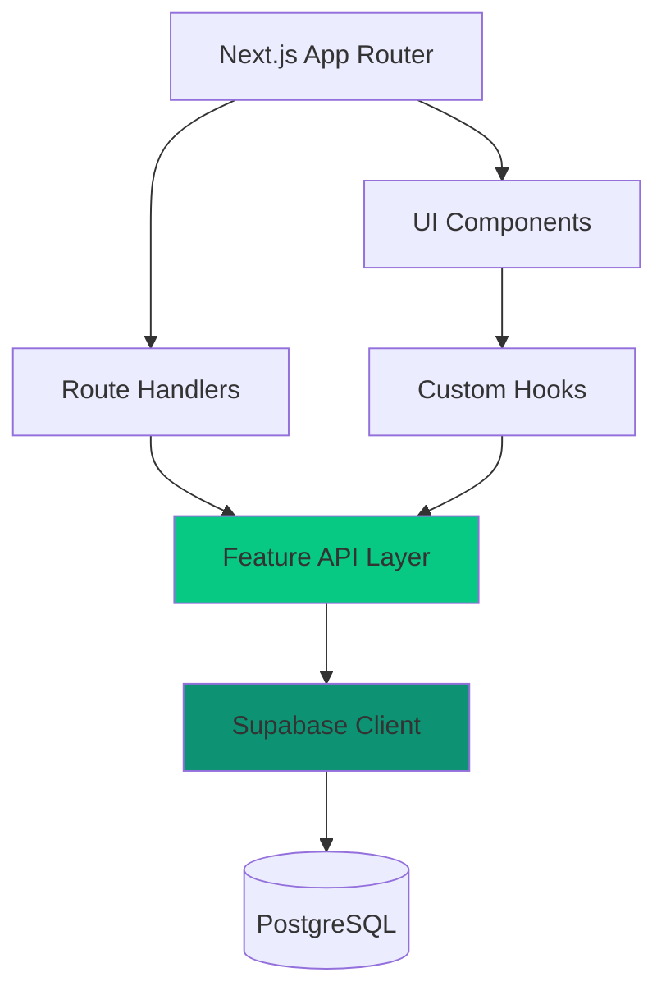

### 1. Feature-Based Structure

Organisation par **domaine métier** plutôt que par type technique.

```
src/features/
├── tools/
│   ├── api/
│   ├── components/
│   ├── hooks/
│   └── types/
├── workflows/
└── tool-packs/
```

**Avantages :**

- Isolation des fonctionnalités
- Facilite le travail en équipe
- Suppression/ajout de features sans impact

<Card title="En savoir plus" icon="arrow-right" href="/architecture/feature-based">
  Guide détaillé de l'approche feature-based
</Card>

---

### 2. API Layer découplée

Séparation stricte entre :

- **Route Handlers** (`app/api/`) : points d'entrée HTTP
- **Business Logic** (`src/features/*/api/`) : règles métier
- **Data Access** (Supabase client) : accès base de données

```typescript
// app/api/tools/route.ts
import { getTools } from '@/features/tools/api/tools-api';

export async function GET() {
  const tools = await getTools();
  return Response.json(tools);
}
```

<Tip>
  La logique métier reste testable indépendamment des routes Next.js
</Tip>

---

### 3. Patterns standardisés

<CardGroup cols={3}>
  <Card title="Modals" icon="window-maximize">
    Pattern d'ouverture via URL
  </Card>
  <Card title="Forms" icon="file-lines">
    React Hook Form + Zod
  </Card>
  <Card title="Routes" icon="route">
    App Router + Parallel Routes
  </Card>
</CardGroup>

<Card title="Voir tous les patterns" icon="book-open" href="/architecture/patterns">
  Documentation complète des patterns
</Card>

---

## Schéma visuel



---

## Structure de dossiers

```
kitasso/
├── app/                  # Next.js App Router
│   ├── (auth)/          # Routes authentifiées
│   ├── (public)/        # Routes publiques
│   └── api/             # API endpoints
│
├── src/
│   ├── features/        # Features métier
│   │   ├── tools/
│   │   ├── workflows/
│   │   └── tool-packs/
│   │
│   ├── shared/          # Code partagé
│   │   ├── components/
│   │   ├── hooks/
│   │   └── utils/
│   │
│   └── lib/             # Clients externes
│       └── supabase/
│
└── supabase/            # Migrations & config
```

<AccordionGroup>
  <Accordion title="app/ - Next.js App Router">
    Contient toutes les routes de l'application :

    - `(auth)/` : pages nécessitant une authentification
    - `(public)/` : pages accessibles sans compte
    - `api/` : endpoints API REST
  </Accordion>
  <Accordion title="src/features/ - Domaines métier">
    Chaque feature contient :

    - `api/` : logique métier et accès données
    - `components/` : composants UI spécifiques
    - `hooks/` : hooks React custom
    - `types/` : types TypeScript
  </Accordion>
  <Accordion title="src/shared/ - Code partagé">
    Éléments réutilisables entre features :

    - Composants UI génériques
    - Hooks utilitaires
    - Fonctions helpers
  </Accordion>
  <Accordion title="src/lib/ - Clients externes">
    Configuration des services tiers :

    - Client Supabase
    - Authentification
    - Storage
  </Accordion>
</AccordionGroup>

---

## Navigation recommandée

<Steps>
  <Step title="Comprendre l'approche feature-based">
    [Architecture feature-based](/architecture/feature-based)

    Découvrez pourquoi nous organisons le code par domaine métier
  </Step>
  <Step title="Explorer les patterns">
    [Patterns de code](/architecture/patterns)

    Modals, forms, routes : les standards à suivre
  </Step>
  <Step title="Découvrir l'API">
    [API Overview](/api/overview)

    Documentation des endpoints disponibles
  </Step>
</Steps>

---

## Principes directeurs

<CardGroup cols={2}>
  <Card title="Modularité" icon="puzzle-piece">
    Chaque feature peut être activée/désactivée indépendamment
  </Card>
  <Card title="Testabilité" icon="flask">
    La logique métier est découplée du framework
  </Card>
  <Card title="Type Safety" icon="shield">
    TypeScript strict + validation Zod partout
  </Card>
  <Card title="Performance" icon="rocket">
    Server Components par défaut, hydratation minimale
  </Card>
</CardGroup>

<Warning>
  Ne contournez pas l'architecture feature-based en créant des dossiers par type technique (components/, hooks/, utils/ à la racine)
</Warning>