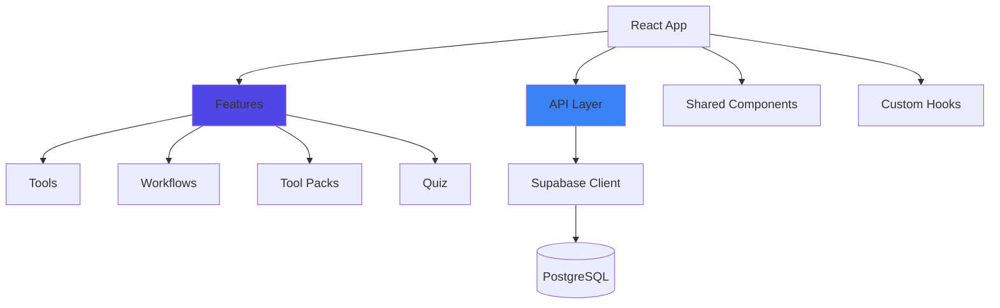

## Qu'est-ce que Kit'Asso ?

Kit'Asso est une plateforme complète qui aide les associations à découvrir, comparer et adopter les meilleurs outils numériques adaptés à leurs besoins.

**Mission :** Simplifier la transformation digitale des associations en offrant un catalogue curé, des parcours guidés et des recommandations personnalisées.

---

## En chiffres

<CardGroup cols={4}>
  <Card title="100+ Outils" icon="wrench">
    Catalogue exhaustif d'outils numériques
  </Card>
  <Card title="13 Tables" icon="database">
    Architecture Supabase complète avec RLS
  </Card>
  <Card title="~5,200 Lignes" icon="code">
    Codebase TypeScript structurée
  </Card>
  <Card title="43 Migrations" icon="arrows-rotate">
    Évolution trackée de la base de données
  </Card>
</CardGroup>

---

## Fonctionnalités principales

### 🔍 Discovery & Comparaison d'outils

Explorez un catalogue de 100+ outils numériques :

- Recherche avancée avec filtres multiples
- Comparaison côte à côte de 2 outils
- Système de favoris persistant
- Catégorisation par usage et pricing

<Card title="Découvrir la feature Tools" icon="arrow-right" href="/features/tools">
  Documentation complète
</Card>

---

### 🛤️ Parcours Guidés (Workflows)

Des tutoriels pas à pas pour vos projets digitaux :

- 3 niveaux de difficulté (Débutant, Intermédiaire, Expert)
- Recommandations d'outils intégrées
- Checklists de complétion
- Templates et bonnes pratiques

**Exemples de workflows :**

- "Créer ma première newsletter" (30 min)
- "Organiser un événement" (1h)
- "Créer un site vitrine" (45 min)

<Card title="Explorer les Workflows" icon="arrow-right" href="/features/workflows">
  Documentation complète
</Card>

---

### 📦 Tool Packs (Collections curées)

Des bundles thématiques pour démarrer rapidement :

- Starter Pack ⭐ (essentiels débutants)
- Communication & Email
- Automatisation
- Paiements & Dons
- Sites Web

<Card title="Voir les Tool Packs" icon="arrow-right" href="/features/tool-packs">
  Documentation complète
</Card>

---

### 📊 Quiz Diagnostic

Évaluation interactive pour recommandations personnalisées :

- Questions adaptées au contexte associatif
- Logique conditionnelle avancée
- Recommandations d'outils et packs
- Capture d'email pour suivi

<Card title="Système Quiz" icon="arrow-right" href="/features/quiz">
  Documentation complète
</Card>

---

### ⚙️ Dashboard Admin

Interface de gestion complète :

- CRUD complet sur tous les contenus
- Upload de logos vers Supabase Storage
- Éditeur visuel de workflows
- Builder de quiz avec règles conditionnelles

<Card title="Admin Dashboard" icon="arrow-right" href="/features/admin">
  Documentation complète
</Card>

---

## Stack technique

<AccordionGroup>
  <Accordion title="Frontend">
    - **React 18** avec TypeScript strict
    - **Vite 6.3.5** pour builds ultra-rapides
    - **Tailwind CSS** pour le design system
    - **React Router v6** pour navigation client
    - **React Hook Form + Zod** pour validation
    - **Lucide React** pour 300+ icônes
    - **react-window** pour virtualisation
  </Accordion>
  <Accordion title="Backend & Database">
    - **Supabase** (PostgreSQL + Auth + Storage)
    - **13 tables** avec relations complètes
    - **Row Level Security (RLS)** sur toutes les tables
    - **2 buckets Storage** (logos + assets)
    - **43 migrations** trackées
  </Accordion>
  <Accordion title="Déploiement">
    - **Netlify** pour hosting frontend
    - **SPA redirects** configurés
    - **Environment variables** pour Supabase
    - **Optimisations** : code splitting, lazy loading
  </Accordion>
  <Accordion title="Testing & Quality">
    - **Vitest 3.2.4** pour tests unitaires
    - **@testing-library/react** pour composants
    - **ESLint 9.10.0** pour linting
    - **TypeScript 5.5.4** strict mode
  </Accordion>
</AccordionGroup>

---

## Architecture

Kit'Asso utilise une **architecture feature-based** pour une organisation claire et scalable.



<CardGroup cols={2}>
  <Card title="Architecture globale" icon="sitemap" href="/architecture/overview">
    Vue d'ensemble du projet
  </Card>
  <Card title="Feature-Based" icon="layer-group" href="/architecture/feature-based">
    Organisation par domaine métier
  </Card>
  <Card title="API Layer" icon="plug" href="/architecture/api-layer">
    Couche d'abstraction Supabase
  </Card>
  <Card title="Database Schema" icon="database" href="/database/schema">
    13 tables détaillées
  </Card>
</CardGroup>

---

## Démarrage rapide

<Steps>
  <Step title="Cloner le projet">
    ```bash
    git clone https://github.com/Lucdidi3514/assopedia-v2
    cd kitasso
    npm install
    ```
  </Step>
  <Step title="Configuration Supabase">
    Créez un fichier `.env` :

    ```bash
    VITE_SUPABASE_URL=your_supabase_url
    VITE_SUPABASE_ANON_KEY=your_anon_key
    ```
  </Step>
  <Step title="Lancer le serveur">
    ```bash
    npm run dev
    ```

    Ouvrez http://localhost:5173
  </Step>
</Steps>

<Card title="Guide complet d'installation" icon="rocket" href="/quickstart">
  Configuration détaillée étape par étape
</Card>

---

## Navigation recommandée

### Pour les développeurs débutants

<Steps>
  <Step title="Quickstart">
    [Installation locale](/quickstart)
  </Step>
  <Step title="Architecture">
    [Comprendre l'organisation](/architecture/overview)
  </Step>
  <Step title="Première feature">
    [Feature Tools en détail](/features/tools)
  </Step>
</Steps>

### Pour les développeurs expérimentés

<CardGroup cols={3}>
  <Card title="API Layer" icon="plug" href="/development/api-layer">
    Abstraction Supabase
  </Card>
  <Card title="Custom Hooks" icon="hook" href="/development/hooks">
    Logique métier réutilisable
  </Card>
  <Card title="Testing" icon="flask" href="/development/testing">
    Vitest + Testing Library
  </Card>
</CardGroup>

---

## Contribution

Kit'Asso est un projet en constante évolution. Pour contribuer :

1. **Lisez les conventions** → [Conventions de code](/development/conventions)
2. **Créez une branche** → `feature/votre-feature`
3. **Écrivez des tests** → Coverage minimum 70%
4. **Soumettez une PR** → Review par l'équipe

---

## Support

<CardGroup cols={2}>
  <Card title="GitHub Issues" icon="github" href="https://github.com/Lucdidi3514/assopedia-v2">
    Signaler un bug ou proposer une feature
  </Card>
  <Card title="Discussions" icon="comments" href="https://github.com/Lucdidi3514/assopedia-v2">
    Questions et échanges
  </Card>
</CardGroup>